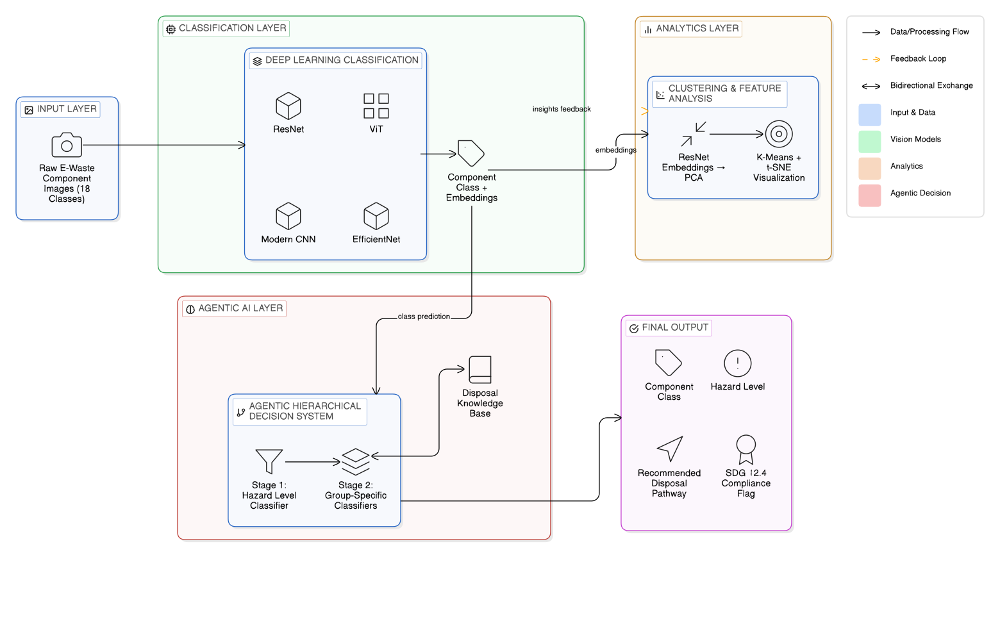
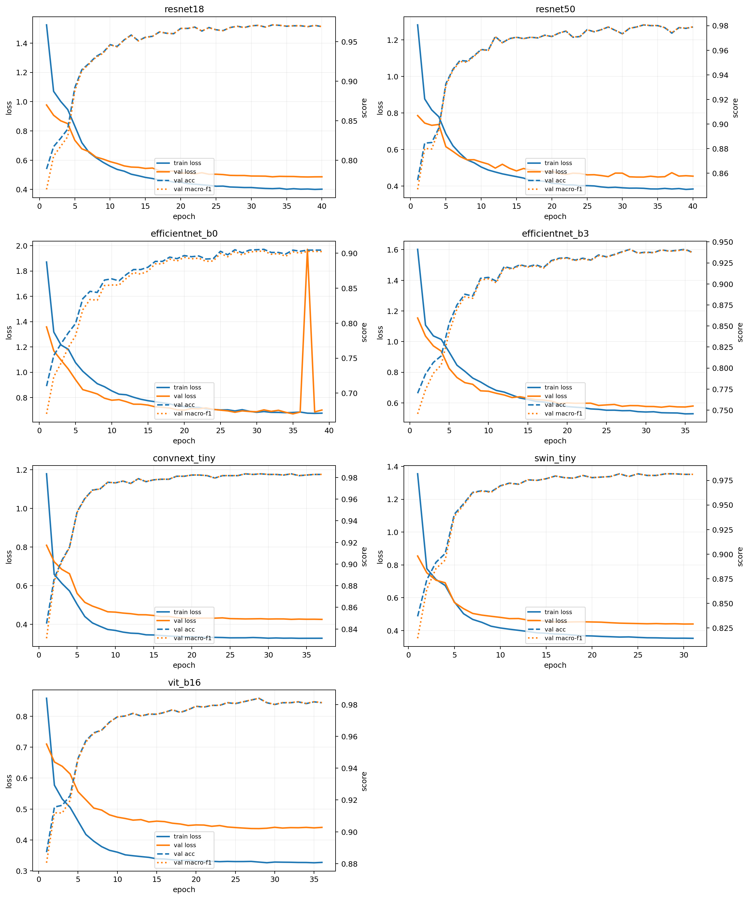
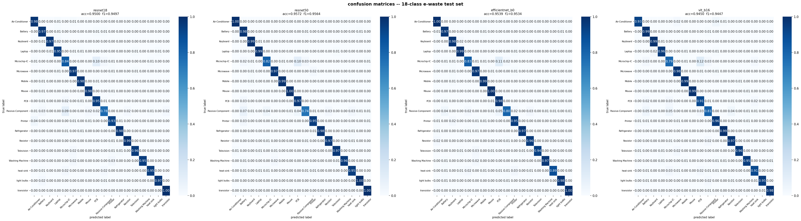
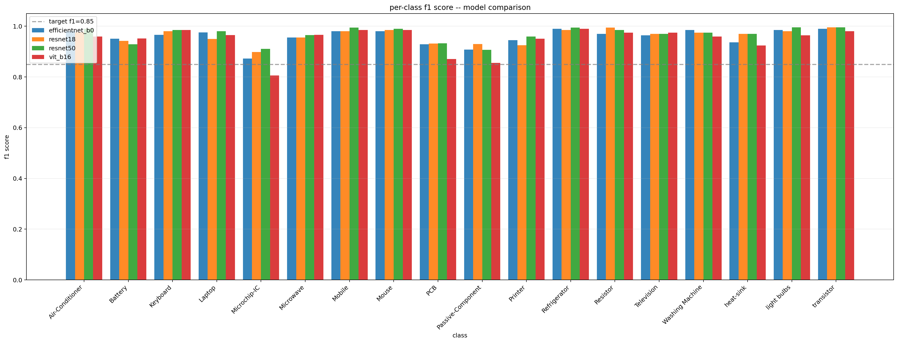
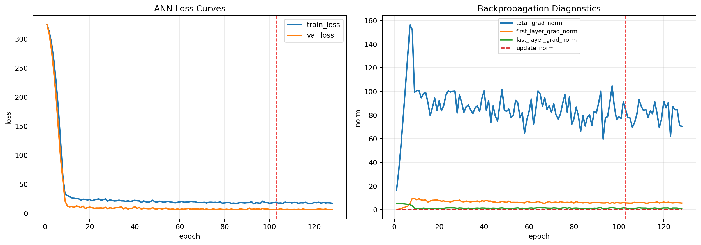
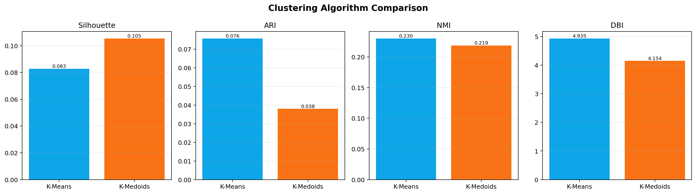

# E-Waste Vision Intelligence System

E-waste component intelligence for **classification**, **detector-assisted mixed-scene review**, **hazard-aware routing**, and **analytics aligned with SDG 12.4 / SDG 12.5**.

This repository combines:

- deep learning classification for 18 e-waste component classes
- benchmark comparison across CNN and transformer backbones
- deep-vs-traditional model competition on learned embeddings
- unsupervised clustering analytics with K-Means and K-Medoids comparison
- a tabular ANN hazard model with backpropagation diagnostics
- a policy and agent layer for disposal guidance
- a Streamlit operations dashboard for single images, clustered scenes, and sampled conveyor-belt video review
- supplementary notebooks for agentic AI, generative AI, clustering extensions, and GAN analysis

## 1. Project Scope

The project addresses a practical research question:

> Can e-waste components be recognized visually and translated into hazard-aware routing decisions, while remaining transparent enough for research reporting and operational prototyping?

The answer in the current repository is:

- an **18-class visual classifier** for single dominant objects
- a **detector-assisted dashboard workflow** for mixed scenes and conveyor-belt footage
- a **hazard-routing layer** that maps recognized components into SDG-linked disposal actions
- a **supporting analytics stack** for ANN hazard modeling, clustering, benchmarking, and explainability

Important scope note:

- the deployed recognition core is still a **classifier**, not a custom-trained 18-class object detector
- cluster-image and video lanes use **pretrained localization proposals + crop classification**
- this makes the dashboard operationally much stronger than a toy upload demo, but it is still a **decision-support prototype**, not a finished industrial automation stack

## 2. System Architecture



The architecture diagram above is the canonical project flow used for the paper and README. It summarizes the dataset, benchmark training, selected `ConvNeXt-Tiny` deployment path, detector-assisted dashboard workflows, hazard-routing layer, and supporting ANN / clustering / copilot modules.

## 3. Repository Layout

- `data/`: image dataset in `ImageFolder` format with `train/`, `val/`, and `test/`
- `training/`: deep benchmark and competition scripts
- `training/image_preprocessing.py`: aspect-ratio-preserving preprocessing utilities
- `pipelines/`: clustering and ANN hazard pipelines
- `evaluation/`: reusable evaluation and plotting utilities
- `agent/`: hazard lookup, compliance checks, disposal recommendations, and LLM-aware decision logic
- `dashboard/`: Streamlit application for operations, policy, analytics, registry, and copilot workflows
- `models/`: checkpoints, JSON summaries, plots, and analytical artifacts
- `notebooks/`: reproducible notebooks for the main study and supplementary assignment-oriented studies
- `paper/`: supporting paper assets

## 4. Dataset and Taxonomy

### 4.1 Dataset format

The dataset is organized as an `ImageFolder` classification corpus:

- `data/train`: 23,960 images
- `data/val`: 1,800 images
- `data/test`: 1,800 images
- total: **27,560 images**
- classes: **18**

The current codebase uses **aspect-ratio-preserving resize-and-pad preprocessing** so the full object remains visible even when original image sizes differ substantially.

### 4.2 Class taxonomy

The 18 component classes are:

- `Air-Conditioner`
- `Battery`
- `Keyboard`
- `Laptop`
- `Microchip-IC`
- `Microwave`
- `Mobile`
- `Mouse`
- `PCB`
- `Passive-Component`
- `Printer`
- `Refrigerator`
- `Resistor`
- `Television`
- `Washing Machine`
- `heat-sink`
- `light bulbs`
- `transistor`

### 4.3 Class-wise split distribution

| Class | Train | Val | Test | Total |
| --- | ---: | ---: | ---: | ---: |
| Air-Conditioner | 2114 | 100 | 100 | 2314 |
| Battery | 1160 | 100 | 100 | 1360 |
| heat-sink | 800 | 100 | 100 | 1000 |
| Keyboard | 1259 | 100 | 100 | 1459 |
| Laptop | 1415 | 100 | 100 | 1615 |
| light bulbs | 1413 | 100 | 100 | 1613 |
| Microchip-IC | 3556 | 100 | 100 | 3756 |
| Microwave | 1113 | 100 | 100 | 1313 |
| Mobile | 839 | 100 | 100 | 1039 |
| Mouse | 800 | 100 | 100 | 1000 |
| Passive-Component | 2692 | 100 | 100 | 2892 |
| PCB | 841 | 100 | 100 | 1041 |
| Printer | 1661 | 100 | 100 | 1861 |
| Refrigerator | 1098 | 100 | 100 | 1298 |
| Resistor | 800 | 100 | 100 | 1000 |
| Television | 800 | 100 | 100 | 1000 |
| transistor | 800 | 100 | 100 | 1000 |
| Washing Machine | 799 | 100 | 100 | 999 |
| **Total** | **23960** | **1800** | **1800** | **27560** |

### 4.4 Hazard-aware taxonomy

Every recognized component is mapped by the policy layer to:

- `hazard_level`: `HIGH`, `MEDIUM`, or `LOW`
- `material_profile`
- `disposal_pathway`
- `sdg_target`
- `requires_human_review`

Examples:

- `Battery` -> `HIGH` -> `send to hazardous battery recycling facility`
- `PCB` -> `HIGH` -> `send to certified ewaste recycler for metal recovery`
- `Printer` -> `MEDIUM` -> `route to ewaste stream with toner-safe handling`
- `Keyboard` -> `LOW` -> `route to plastics and small-ewaste stream`

These mappings live centrally in [`agent/tools.py`](agent/tools.py), which keeps disposal reasoning explicit and auditable.

## 5. Core Model Benchmark

### 5.1 Architectures evaluated

The benchmark runner evaluates:

- `resnet18`
- `resnet50`
- `efficientnet_b0`
- `efficientnet_b3`
- `convnext_tiny`
- `swin_tiny`
- `vit_b16`

Training is handled by [`training/research_benchmark.py`](training/research_benchmark.py).

### 5.2 Current benchmark summary

The current saved benchmark artifacts select **ConvNeXt-Tiny** as the best deployed model.

| Model | Test Accuracy | Macro-F1 | Weighted-F1 | Test Loss | Elapsed Seconds |
| --- | ---: | ---: | ---: | ---: | ---: |
| ResNet18 | 96.78% | 0.9678 | 0.9678 | 0.4950 | 6223.23 |
| ResNet50 | 97.89% | 0.9789 | 0.9789 | 0.4537 | 8150.52 |
| EfficientNet-B0 | 91.28% | 0.9115 | 0.9115 | 1.0918 | 5356.05 |
| EfficientNet-B3 | 94.22% | 0.9419 | 0.9419 | 0.5773 | 6377.65 |
| **ConvNeXt-Tiny** | **98.11%** | **0.9811** | **0.9811** | **0.4332** | **7695.14** |
| Swin-Tiny | 97.67% | 0.9767 | 0.9767 | 0.4506 | 6245.64 |
| ViT-B16 | 98.11% | 0.9811 | 0.9811 | 0.4312 | 12013.19 |

### 5.3 Why ConvNeXt-Tiny was selected

`ConvNeXt-Tiny` and `ViT-B16` reached the same top-line accuracy in the saved benchmark, but `ConvNeXt-Tiny` is the selected deployed model because:

- it is the model referenced in [`models/classification/best_model.json`](models/classification/best_model.json)
- it matches the best accuracy while being materially faster than `ViT-B16`
- it gives a strong balance of accuracy, runtime, and deployment practicality for the dashboard

### 5.4 Per-class behavior of the selected model

The strongest `ConvNeXt-Tiny` per-class F1 scores are near-perfect for many classes. The relatively more difficult classes are:

- `Passive-Component`: `0.9490`
- `Microchip-IC`: `0.9519`
- `Printer`: `0.9645`
- `heat-sink`: `0.9746`
- `Laptop`: `0.9754`

This is consistent with a fine-grained electronics problem where visually similar smaller components remain harder than large, highly distinctive devices.

## 6. End-to-End Workflow

### 6.1 Stage 1: Deep benchmark training

Input:

- `data/train`
- `data/val`
- `data/test`

Training characteristics:

- transfer learning from pretrained backbones
- aspect-ratio-preserving preprocessing
- weighted sampling and class-aware training safeguards
- `AdamW` optimization
- fine-tuning after initial freezing
- macro-F1-aware model selection
- optional AMP on CUDA
- test-time augmentation in saved benchmark configuration

Artifacts written:

- `models/classification/<arch>/<arch>_best.pth`
- `models/classification/<arch>/results.json`
- `models/classification/test_results.json`
- `models/classification/best_model.json`
- `models/classification/benchmark_summary.json`
- plots under `models/classification/graphs/`

### 6.2 Stage 2: Best-model deployment

The best saved model is promoted to dashboard use. In the current repository state, the deployed visual model is:

- architecture: `convnext_tiny`
- checkpoint: `models/classification/convnext_tiny/convnext_tiny_best.pth`
- test accuracy: `98.11%`
- macro-F1: `0.9811`

### 6.3 Stage 3: Model competition

[`training/model_competition.py`](training/model_competition.py) compares:

- saved deep models directly
- traditional ML models trained on deep embeddings

Current competition leaderboard highlight:

- winner: `logistic_regression`
- accuracy: `98.22%`
- embedding source: `ConvNeXt-Tiny`

Interpretation:

- the learned ConvNeXt feature space is strong enough that a linear downstream classifier performs extremely well
- the dashboard still deploys **ConvNeXt-Tiny itself** for end-to-end inference because it is the native image model and does not require a second-stage classical inference stack

Artifacts:

- [`models/competition/leaderboard.json`](models/competition/leaderboard.json)
- `models/competition/deep_results.json`
- `models/competition/traditional_ml_results.json`
- `models/competition/all_players_results.json`

### 6.4 Stage 4: Clustering analytics

[`pipelines/clustering_pipeline.py`](pipelines/clustering_pipeline.py) explores the structure of learned visual embeddings.

Current pipeline:

- feature extractor: `ResNet50` checkpoint
- total clustered samples: `27,560`
- standardization with `StandardScaler`
- PCA with `95%` variance retained
- resulting PCA components: `1464`
- default clustering: `KMeans(n_clusters=3)`

Current K-Means metrics:

- silhouette score: `0.0783`
- Davies-Bouldin index: `4.9347`
- Calinski-Harabasz index: `1034.56`
- adjusted Rand index: `0.0757`
- normalized mutual information: `0.2301`

Supplementary K-Means vs K-Medoids comparison:

- `K-Medoids` improves internal compactness
  - silhouette: `0.1054`
  - Davies-Bouldin index: `4.1538`
- `K-Means` aligns slightly better with known labels
  - ARI: `0.0757` vs `0.0380`
  - NMI: `0.2301` vs `0.2187`

Interpretation:

- the embedding space contains **coarse latent structure**
- it does **not** split cleanly into 18 pure unsupervised class groups
- clustering is therefore treated as a **supporting research analysis**, not a deployed predictive module

### 6.5 Stage 5: ANN hazard modeling

[`pipelines/ann_hazard_pipeline.py`](pipelines/ann_hazard_pipeline.py) models hazard severity separately from image classification.

Current ANN features:

- `comp_enc`
- `age_years`
- `weight_kg`
- `contains_lithium`
- `contains_lead`
- `contains_mercury`
- `contains_cadmium`
- `contains_cfc`
- `recyclable`
- `mat_enc`
- `wc_enc`
- `cond_enc`
- `reg_enc`
- `disp_enc`

Current ANN results:

- train samples: `1890`
- val samples: `405`
- test samples: `405`
- hazard class accuracy: `95.56%`
- hazard macro-F1: `0.9249`
- MAE: `2.7521`
- RMSE: `3.7666`
- R^2: `0.9859`

### 6.6 Stage 6: ANN backpropagation diagnostics

The supplementary notebook [`notebooks/09_ann_backpropagation_study.ipynb`](notebooks/09_ann_backpropagation_study.ipynb) adds training-dynamics analysis.

Current backprop summary:

- best epoch: `103`
- best validation loss: `6.0876`
- optimizer: `AdamW`
- loss: `HuberLoss(delta=5.0)`
- gradient clipping: `1.0`
- peak total gradient norm: `156.2793`
- mean total gradient norm: `85.3744`
- test R^2: `0.9860`

Interpretation:

- gradient flow reaches both early and late layers
- clipping stabilizes training despite large raw gradient norms
- the ANN converges in a controlled way and supports the hazard reasoning layer with a quantitatively strong fit

## 7. Dashboard Workflow

The Streamlit dashboard in [`dashboard/app.py`](dashboard/app.py) is the operational face of the system.

Launch command:

```powershell
streamlit run dashboard\app.py
```

### 7.1 Workspace structure

The dashboard currently exposes six workspaces:

- `Operations`
- `Policy`
- `Benchmarks`
- `Analytics`
- `Registry`
- `Copilot`

### 7.2 Operations workspace

The `Operations` workspace now supports three modes:

#### A. Single-item triage

Purpose:

- benchmark-aligned single-image classification

Behavior:

- classifies one uploaded image with `ConvNeXt-Tiny`
- reports class, confidence, latency, and top scores
- optionally runs a composite scene scan for uncertainty triage

#### B. Cluster image review

Purpose:

- review images containing multiple e-waste items in one scene

Behavior:

- uses **pretrained Faster R-CNN MobileNetV3 320 FPN** for localization proposals
- augments those proposals with a **classifier-driven scene scan** to recover classes the COCO detector often misses
- classifies retained crops with the e-waste classifier
- aggregates a cluster-level hazard and routing report

Outputs include:

- overlay image with localized objects
- per-object classification table
- component summary
- hazard counts
- routing decision
- JSON export
- CSV export

#### C. Video belt review

Purpose:

- review short conveyor-belt videos in a more factory-like setting

Behavior:

- uploads a video file
- samples frames with OpenCV
- localizes objects using the same hybrid proposal strategy
- classifies each retained crop
- aggregates a belt-segment report

Outputs include:

- sampled-frame summaries
- per-event object table
- average objects per frame
- hazard distribution
- route diversity
- review rate
- automation clear rate
- belt-segment level disposal recommendation

Important limitation:

- this is **frame-wise sampled video analysis**, not full multi-object tracking across time

### 7.3 Policy workspace

The `Policy` workspace translates recognition output into operational guidance.

For each inference, it can surface:

- `hazard_level`
- `material_profile`
- `disposal_pathway`
- `sdg_target`
- `requires_human_review`
- `agent_mode`
- `llm_provider`
- `explanation_source`
- `tool_trace`

This keeps the routing layer transparent rather than acting like a black box.

### 7.4 Benchmarks workspace

This workspace presents the scientific evidence behind the model:

- best benchmark summary
- confusion matrices
- training curves
- per-class F1 comparison
- Grad-CAM interpretability outputs

### 7.5 Analytics workspace

This workspace brings together:

- ANN hazard metrics
- ANN backpropagation diagnostics
- clustering outputs
- K-Means vs K-Medoids comparison
- model competition results
- an embedded `System Copilot`

### 7.6 Registry workspace

This workspace acts as the system inventory:

- available checkpoints
- active deployed model
- dataset distribution
- hazard taxonomy
- material and disposal mappings

### 7.7 Copilot workspace

The `Copilot` is a project-scoped chatbot.

Behavior:

- if `GROQ_API_KEY` is set, it uses a transformer-backed Groq model
- otherwise it falls back to deterministic local replies for common project questions

Context grounding includes:

- current benchmark winner
- ANN metrics
- clustering results
- current inference state
- hazard-routing rules

It is intentionally restricted to the project domain rather than acting as a general assistant.

## 8. Agentic and Generative AI Layer

The project includes an explicit agent / copilot layer rather than placeholder text.

Decision records can expose:

- `agent_mode`
- `llm_provider`
- `explanation_source`
- `tool_trace`

The agent flow is built around:

- hazard lookup
- compliance threshold checking
- disposal recommendation generation
- optional LLM augmentation when Groq is configured

Supporting supplementary notebooks:

- [`notebooks/07_agentic_ai_workbench.ipynb`](notebooks/07_agentic_ai_workbench.ipynb)
- [`notebooks/08_generative_ai_research_writer.ipynb`](notebooks/08_generative_ai_research_writer.ipynb)

Saved agentic casebook:

- [`models/agentic/agentic_workbench_cases.json`](models/agentic/agentic_workbench_cases.json)

## 9. Notebook Workflow

### 9.1 Core pipeline notebooks

- [`notebooks/01_data_prep.ipynb`](notebooks/01_data_prep.ipynb): dataset preparation and inspection
- [`notebooks/02_cnn_classification.ipynb`](notebooks/02_cnn_classification.ipynb): classification experimentation
- [`notebooks/03_clustering.ipynb`](notebooks/03_clustering.ipynb): clustering workflow
- [`notebooks/04_ann_hazard.ipynb`](notebooks/04_ann_hazard.ipynb): ANN hazard modeling
- [`notebooks/05_full_comparison.ipynb`](notebooks/05_full_comparison.ipynb): comparative analysis
- [`notebooks/06_results_gallery.ipynb`](notebooks/06_results_gallery.ipynb): consolidated artifact gallery

### 9.2 Supplementary notebooks

These studies extend the project without disturbing the main benchmark and dashboard pipeline:

- [`notebooks/07_agentic_ai_workbench.ipynb`](notebooks/07_agentic_ai_workbench.ipynb)
- [`notebooks/08_generative_ai_research_writer.ipynb`](notebooks/08_generative_ai_research_writer.ipynb)
- [`notebooks/09_ann_backpropagation_study.ipynb`](notebooks/09_ann_backpropagation_study.ipynb)
- [`notebooks/10_clustering_kmeans_kmedoids.ipynb`](notebooks/10_clustering_kmeans_kmedoids.ipynb)
- [`notebooks/11_gan_model_analysis.ipynb`](notebooks/11_gan_model_analysis.ipynb)

### 9.3 GAN analysis notebook

The GAN study is deliberately separate from the main classification workflow.

Current saved GAN study notes:

- selected classes: `Battery`, `Mobile`, `PCB`, `light bulbs`
- best trial recorded in [`models/gan_study/best_gan_config.json`](models/gan_study/best_gan_config.json)
- artifact plots written under `models/gan_study/graphs/`

This notebook is intended as a supplementary assignment / exploratory study, not as the deployed generation pipeline for the project.

## 10. Key Artifacts

### 10.1 Classification training curves



### 10.2 Classification confusion matrices



### 10.3 Per-class F1 comparison



### 10.4 ANN backpropagation diagnostics



### 10.5 K-Means vs K-Medoids comparison



Other artifact locations:

- classification graphs: `models/classification/graphs/`
- ANN graphs: `models/ann/graphs/`
- clustering graphs: `models/clustering/graphs/`
- GAN graphs: `models/gan_study/graphs/`

## 11. How to Run

### 11.1 Environment setup

Create a virtual environment and install the project dependencies:

```powershell
python -m venv .venv
.\.venv\Scripts\Activate.ps1
pip install -r requirements.txt
```

Install a matching `torch` and `torchvision` build for your CPU or GPU environment if they are not already available.

Optional environment variables:

```powershell
$env:GROQ_API_KEY="YOUR_GROQ_KEY"
$env:GROQ_MODEL="openai/gpt-oss-20b"
```

### 11.2 Main pipeline commands

Train or retrain the benchmark:

```powershell
python run_system.py train
```

Run the deep-vs-traditional competition:

```powershell
python run_system.py compete
```

Run clustering:

```powershell
python run_system.py cluster
```

Run the ANN hazard pipeline:

```powershell
python run_system.py ann
```

Run the full sequence:

```powershell
python run_system.py all
```

Force a fresh classification retrain before the full sequence:

```powershell
python run_system.py all --force-train
```

### 11.3 Dashboard

```powershell
streamlit run dashboard\app.py
```

Note:

- the first detector-assisted cluster/video run may download pretrained `torchvision` detection weights into the local cache

### 11.4 Notebooks

Open Jupyter or VS Code notebooks and run the files in `notebooks/` for reproducible analyses and supplementary studies.

## 12. Practical Interpretation

What the system is strong at:

- high-accuracy single-item e-waste classification
- transparent hazard-aware routing
- benchmark-backed research communication
- project-scoped copilot explanations
- mixed-scene and video decision support through detector-assisted review

What the system is not yet:

- a custom-trained 18-class e-waste object detector
- a real-time tracked conveyor-belt actuation system
- a final industrial control product

Why this matters:

- cluster-image and video workflows can still over-segment cluttered scenes or duplicate nearby objects
- generic pretrained detection proposals do not perfectly align with the 18-class domain
- final routing decisions in cluttered scenes should still be treated as assisted triage unless a domain-trained detector is added

## 13. Research Takeaways

- **ConvNeXt-Tiny** is the selected deployed classifier with `98.11%` test accuracy and `0.9811` macro-F1.
- A **logistic regression classifier on ConvNeXt embeddings** slightly edges the deep model in the competition leaderboard, which indicates strong feature separability.
- The **hazard ANN** is quantitatively strong with `95.56%` hazard classification accuracy and `R^2 = 0.9859`.
- **Backpropagation diagnostics** show stable ANN training and meaningful gradient flow.
- **Clustering analytics** reveal coarse latent structure, with K-Medoids improving internal compactness and K-Means preserving slightly better class-label alignment.
- The dashboard has moved beyond a toy upload interface into a **workflow-oriented operations console** with single-item, cluster-image, and video-belt review lanes.

## 14. Future Work

The most natural next research step is:

- training a dedicated **18-class e-waste detector** for mixed-scene and conveyor-belt deployment

Additional future directions:

- multi-object tracking across video frames
- detector training from synthetic or weakly labeled e-waste scenes
- tighter policy automation with operator audit logs
- domain-tuned generative augmentation studies
- quantitative evaluation on factory-like belt footage

## 15. Summary

This repository is now best understood as a **modular e-waste intelligence platform**:

- `ConvNeXt-Tiny` provides the primary high-accuracy visual classifier
- the dashboard exposes research and operational workflows
- the policy layer maps recognition into SDG-linked disposal guidance
- ANN, clustering, competition, agentic AI, generative AI, and GAN studies extend the system for research reporting and assignment work

That combination makes it suitable for both **research communication** and **serious prototype demonstration**, while remaining honest about the gap between classifier-assisted review and full industrial object-detection deployment.
